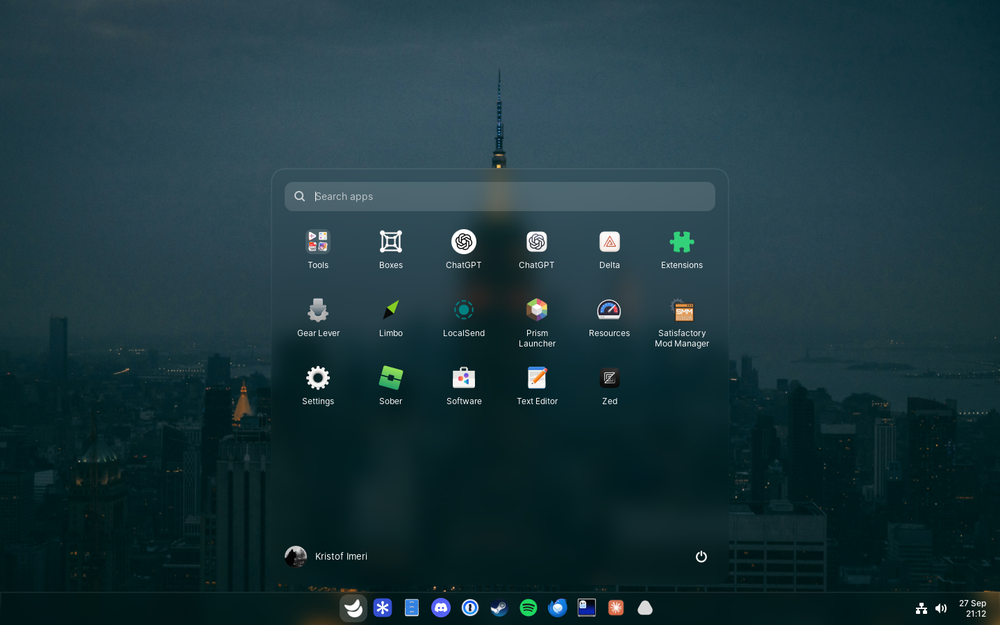
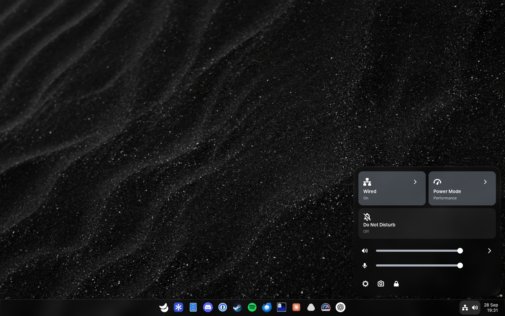

# Luft

Luft is a desktop for Fedora. It brings its own shell and login screen (Kestrel), its own apps, a keyring with passkeys, and a boot chain from a flicker-free splash to TPM disk unlock (Sushi, SushiBoot and trustd). Everything installs next to GNOME, so you can switch back at the login screen.

<p>
  
  
</p>

## Parts

| Path | What it is |
| --- | --- |
| [`kestrel`](kestrel/README.md) | Shell, login screen, session services and installer |
| [`kestrel/compositor`](kestrel/compositor/README.md) | Kestrel's Mutter 51 patch series |
| [`kestrel/engine`](kestrel/engine/README.md) | The native shell, started from GNOME Shell 51.0 |
| [`kestrel/keyring`](kestrel/keyring/README.md) | Luft Keyring: secrets, SSH agent and GnuPG pinentry |
| [`kestrel/passkeys`](kestrel/passkeys/README.md) | Luft Passkeys, offered to every browser as a security key |
| [`boot/sushi`](boot/sushi/README.md) | Sushi boot splash and the SushiBoot boot menu |
| [`security`](security/README.md) | trustd (Secure Boot, signed startup, TPM unlock, encryption) and USB protection |
| [`apps/barometer`](apps/barometer/README.md) | System monitor |
| [`apps/disks`](apps/disks/README.md) | Drives, partitions, encryption and disk images |
| [`apps/draft`](apps/draft/README.md) | Text and code editor |
| [`apps/keys`](apps/keys/README.md) | Keyboard layouts and input methods |
| [`apps/magpie`](apps/magpie/README.md) | Photos, videos, music, PDFs and fonts |
| [`apps/mailman`](apps/mailman/README.md) | Mail |
| [`apps/rover`](apps/rover/README.md) | Files, and the file chooser |
| [`apps/schelf`](apps/schelf/README.md) | App store for Flathub, Fedora and AppImages |
| [`apps/settings`](apps/settings/README.md) | Settings |
| [`apps/signin`](apps/signin/README.md) | Wi-Fi sign-in pages |
| [`apps/tern`](apps/tern/README.md) | Terminal |
| [`packages/ui`](packages/ui/README.md) | Shared Svelte components and styles |
| [`packages/app`](packages/app/README.md) | Shared native window, palette, D-Bus and portal code |
| [`packages/software`](packages/software/README.md) | Packages, Flatpak, AppImages and offline updates for Schelf and Settings |
| [`docs`](docs) | [Boot and recovery](docs/boot.md), [security model](docs/security.md), [testing](docs/testing.md), [wallpaper colors](docs/appearance.md), [prompts](docs/prompts.md) |

## Requirements

- Fedora 45 on x86_64 with UEFI. A TPM 2.0 is optional but needed for unlocking without a password.
- [Bun](https://bun.sh), Rust with Cargo, and the [Sabine](https://github.com/Lantharos/Sabine) CLI for the apps.
- Build dependencies:

```sh
sudo dnf builddep mutter
sudo dnf install meson ninja-build sassc gjs-devel gtk4-devel at-spi2-atk-devel gsettings-desktop-schemas-devel \
  json-glib-devel librsvg2-devel glycin-devel libxkbcommon-devel NetworkManager-libnm-devel libsecret-devel \
  pipewire-devel pulseaudio-libs-devel alsa-lib-devel gstreamer1-devel polkit-devel libxml2-devel \
  cargo pam-devel tpm2-tss-devel
sudo dnf install greetd gstreamer1-plugin-gtk4 cldr-emoji-annotation
```

## Build

A development build stays inside `kestrel/build`, `kestrel/run` and `kestrel/install`, and can be tried in a window:

```sh
bun install
(cd kestrel/ui && bun install --frozen-lockfile)
kestrel/compositor/build.sh
meson setup kestrel/build kestrel/engine -Dpkg_config_path="$PWD/kestrel/run/mutter-install/lib/pkgconfig" --prefix="$PWD/kestrel/install"
meson compile -C kestrel/build
kestrel/tools/session.sh nested
```

After pulling changes, `meson compile -C kestrel/build` is enough; rerun `meson setup` with `--reconfigure` when the build files change.

Each app builds from its own folder with `bun run desktop:build`, or runs with `bun run desktop:dev`.

## Install

In this order:

```sh
kestrel/tools/install.sh install               # Kestrel, its Mutter, Luft Keyring, login screen service
kestrel/passkeys/install.sh install            # Luft Passkeys
security/scripts/install.sh install            # trustd and USB protection
for app in apps/*; do (cd "$app" && sabine install --bundle .); done
```

Then:

1. Switch the login screen from GDM to greetd, as in [Kestrel's README](kestrel/README.md#setting-up-the-login-screen).
2. In Settings, Security, add the Luft Secure Boot key, turn on signed startup and, if you like, device encryption. See [docs/boot.md](docs/boot.md).
3. Install Sushi: `boot/sushi/scripts/install.sh install`, then `boot/sushi/scripts/install.sh enable`.
4. Once everything starts through SushiBoot, remove GRUB and the GNOME services Kestrel replaces with `security/scripts/remove-grub-and-gnome.sh`.

Each install script also takes `remove`.

## Tests

| Command | Checks |
| --- | --- |
| `bun run check` in `kestrel/ui`, an app or `packages/ui` | Type checks |
| `kestrel/tools/session.sh capture` | Every Kestrel surface and the apps in an isolated headless session, with screenshots |
| `cargo test` in `kestrel/keyring` or `kestrel/passkeys` | Vault format, TPM sealing and CTAP |
| `make check` in `boot/sushi` | Formatting, lints and tests for Sushi and SushiBoot |

Session options, the boot VM and the other checks are in [docs/testing.md](docs/testing.md).

## License

Kestrel's engine is GPL-2.0-or-later, inherited from GNOME Shell (`kestrel/engine/COPYING`), and so are the Mutter patches. The rest is MIT unless a folder says otherwise. Open Runde and Maple Mono are under the SIL Open Font License, in `packages/ui/fonts`.
