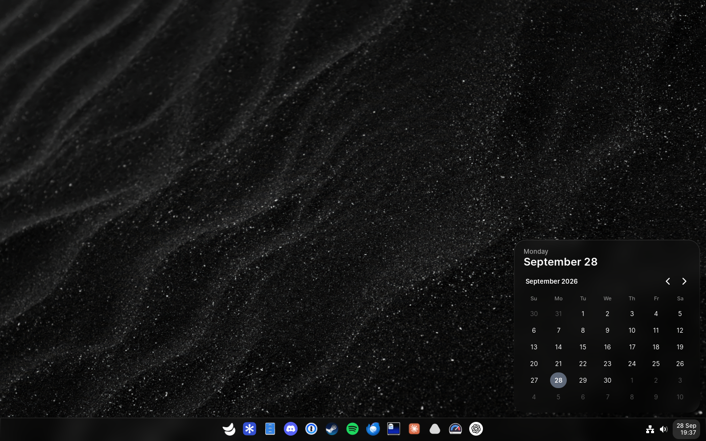
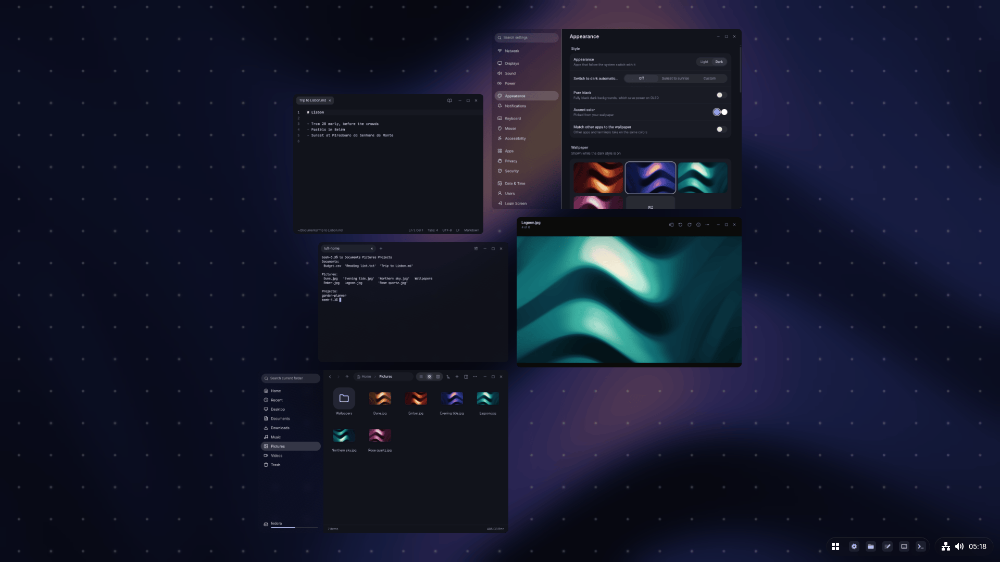
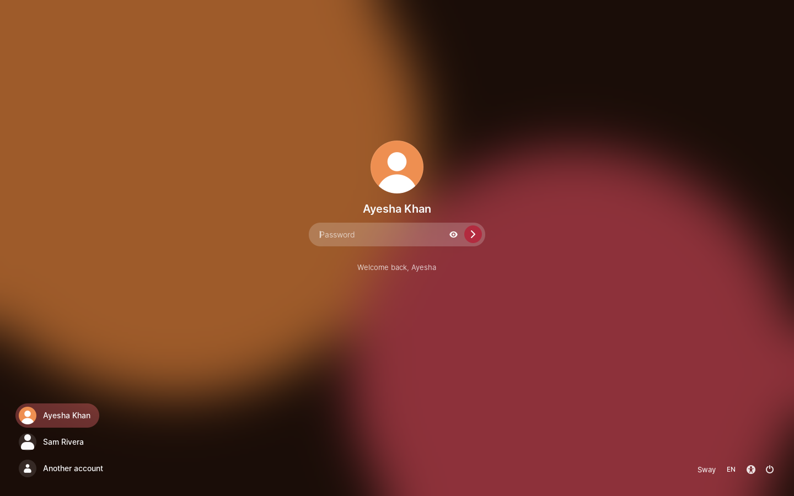

# Kestrel

Kestrel is Luft's desktop shell and login screen. It runs on its own patched Mutter 51 and brings its own panel, Start menu, quick settings, notification center, lock screen, session manager, settings service and portal backend.



## Parts

| Folder | What it is |
| --- | --- |
| [`engine`](engine/README.md) | The native shell, started from GNOME Shell 51.0 |
| `ui` | Panel, Start, quick settings and every other surface, in TypeScript |
| [`compositor`](compositor/README.md) | Mutter patch series |
| `settings` | `kestrel-settings`: XSETTINGS, night light, power, printing, housekeeping, time zone |
| `greeter` | `kestrel-greeter-service`, which stores the login screen's settings |
| [`keyring`](keyring/README.md) | Luft Keyring |
| [`passkeys`](passkeys/README.md) | Luft Passkeys |
| `openconnect` | `kestrel-openconnect`, OpenConnect VPN sign-in |
| `watchdog` | `kestrel-watchdog`, restarts cleanly when the GPU hangs |
| `peek` | `peek`, lets other programs see and use windows |
| `tools` | Development sessions, checks and the installer |

## Features

- Taskbar with pinned and running apps, live window previews, unread counts and progress, and a tray for StatusNotifierItem apps
- Start with folders, search across apps, Settings pages, recent files and calculations
- Quick settings as rearrangeable tiles: network, Bluetooth, audio devices, brightness (including DDC/CI monitors with `ddcutil`), power mode, Night Light, Dark Style, Keep Awake and more
- Notification center with grouping, inline replies, media controls and a calendar
- All-windows view, dynamic workspaces up to ten, snap layouts and snap groups
- Board mode: any desktop becomes an endless canvas where windows sit side by side
- Clipboard history with pictures, and an emoji, symbol and kaomoji picker
- Lock screen and login screen (on greetd) with fingerprint support
- Accent color and a full palette from the wallpaper, shared with apps ([docs/appearance.md](../docs/appearance.md)); tinted or clear app icons; Pure black; live video wallpapers
- Privacy indicator for camera, microphone, screen sharing, location and programs using your windows
- Its own dialogs for polkit, Wi-Fi and VPN secrets, keyring and GnuPG prompts ([docs/prompts.md](../docs/prompts.md)), and every xdg-desktop-portal interface it backs



## Build

Building is covered in the [repository README](../README.md#build). To try a build in a window:

```sh
kestrel/tools/session.sh nested
```

Other session modes and test options are in [docs/testing.md](../docs/testing.md).

## Install as a login session

```sh
kestrel/tools/install.sh install            # into /opt/kestrel
kestrel/tools/install.sh install /opt/other # another prefix
kestrel/tools/install.sh remove
```

This builds Kestrel, its Mutter, `kestrel-settings`, `kestrel-openconnect`, `peek`, Luft Keyring and the watchdog, installs them into the prefix, and links the session entry, user units, portal configuration, `peek` and fonts into `/usr/local`. It also installs the login screen service, the lock screen's `kestrel-authenticate` socket and the watchdog's system service. Session entries are only linked for prefixes under `/opt` or `/usr`. Reinstalling removes files an earlier install left behind.

### Setting up the login screen

A fresh Fedora install starts GDM. Switch to greetd:

```sh
sudo dnf install greetd
kestrel/tools/install.sh install
sudo cp /opt/kestrel/share/kestrel/greetd.toml /etc/greetd/config.toml
sudo systemctl disable gdm && sudo systemctl enable greetd
systemctl reboot
```

The login screen runs on virtual terminal 7. If it doesn't appear, press Ctrl+Alt+F3, sign in, and check `journalctl -b -u greetd`.



The Login Screen page in Settings chooses the wallpaper, which people are listed, the default session and automatic login (written as `initial_session` in `/etc/greetd/config.toml`).

## Keyboard shortcuts

| Shortcut | Action |
| --- | --- |
| Super | Start |
| Super twice | Turn the desktop into a board, or back |
| Super+Tab | All windows |
| Alt+Tab, Alt+\` | Switch windows, or windows of the focused app |
| Ctrl+Alt+Tab | Move focus to the panel |
| Super+1 … Super+9, Super+0 | Workspace 1 to 10 |
| Super+scroll | Next or previous workspace |
| Super+N, Super+M | Notifications |
| Super+S | Quick settings |
| Super+V | Clipboard history |
| Super+. or Super+; | Emoji and symbols |
| Super+Z | Snap layouts |
| Super+arrows | Snap to halves and maximize; on a board, pan or move between windows |
| Super+Space | Next input source |
| Super+L | Lock |
| Super+Escape | Give shortcuts back to the desktop; on a board, step out of a window |
| Super+Enter | On a board, enter the focused window |
| Super+= / Super+- | On a board, zoom in and out |
| Print, Shift+Print, Alt+Print | Screenshot tool, full screenshot, window screenshot |
| Ctrl+Shift+Alt+R | Screen recording |
| Ctrl+Shift+Esc | System monitor |
| Menu or Shift+F10 | Context menu of the focused control |

| Gesture | Action |
| --- | --- |
| Three fingers sideways | Next or previous workspace; on a board, next window |
| Four fingers up / down | Turn the desktop into a board, or back |
| Three fingers (board) | Pan; spread to enter a window, swipe down to step out |
| Pinch (board) | Zoom |

## Seeing and using windows from other programs

`peek` lets a program, such as a development tool, take pictures of windows and click and type in them. `peek --help` explains every command.

```sh
h=$(peek run --wait-window -- cargo run)   # starts it on a hidden display and prints a handle
peek window $h                             # saves a PNG and prints its path
peek click $h 120 40
peek type $h 'Hello'
peek stop $h
```

`peek run` gives every program its own hidden display: a headless Kestrel with its own monitor, pointer and keyboard, so nothing reaches your screen and nothing asks first. The program still uses your session for settings, files, the keyring and the network. The display closes when the program quits. `peek run --here` opens the program on your screen instead.

Windows you opened yourself need permission: Kestrel asks whether the app may see your windows, or see and use them, once or until it quits, and a refusal holds until the app quits. The privacy menu in the panel shows who has access and takes it back. Nothing works while the screen is locked or a password prompt is open, and nothing is remembered after signing out. Hidden displays need `dbus-daemon`.

## Settings

Kestrel's settings live in `com.lantharos.kestrel`. Settings changes most of them; the main keys:

| Key | Values |
| --- | --- |
| `accent` | `wallpaper`, `white` |
| `pure-black` | `true`, `false` |
| `theme-apps` | Write wallpaper colors for GTK, Qt and Ghostty |
| `app-icon-style` | `default`, `tinted`, `clear` |
| `app-icon-tint` | Color for tinted icons, or empty for the accent |
| `dark-schedule` | `off`, `sunset`, `custom` (`dark-schedule-from`, `dark-schedule-to` in hours) |
| `live-wallpaper`, `live-wallpaper-dark` | Video URI for each style |
| `live-wallpaper-on-battery` | Keep playing on battery |
| `variable-refresh` | `games`, `fullscreen` |
| `taskbar-alignment` | `center`, `left` |
| `taskbar-look` | `glass`, `solid`, `transparent`, `accent` |
| `taskbar-style` | `bar`, `floating` |
| `taskbar-size` | `compact`, `normal`, `large` |
| `taskbar-auto-hide` | `never`, `always`, `windows` |
| `taskbar-show-pinned` | Show pinned apps on the taskbar |
| `taskbar-displays` | `all`, `primary` |
| `taskbar-windows-per-display`, `taskbar-windows-per-workspace` | Limit each taskbar to its display's or workspace's windows |
| `lock-screen-content` | Show notification text on the lock screen |

Related schemas: `com.lantharos.kestrel.keybindings`, `.window-switcher`, `.app-switcher`, `.media-keys`, `.power`, `.night-light`, `.touchscreen`, `.notifications.application` and `.diagnostics`. Live wallpapers need `gstreamer1-plugin-gtk4`.

## Files

| Path | Contents |
| --- | --- |
| `~/.local/state/kestrel` | Launch history, brightness, notifications |
| `~/.cache/kestrel/backgrounds` | Scaled and blurred wallpaper copies |
| `~/.config/kestrel/appearance.json`, `appearance.css` | The wallpaper palette for apps |
| `~/.local/share/kestrel/wallpapers` | Still frames of live wallpapers |
| `~/.config/xkb` | Your own keyboard layouts, such as those made in Keys |
| `~/.config/fontconfig/conf.d/50-kestrel-families.conf` | Generic font families pointed at your chosen fonts |
| `/var/lib/kestrel-greeter` | Login screen wallpapers and display arrangement |
| `/var/lib/kestrel-watchdog/incidents` | Reports from GPU hangs |

## Session services

| Service | Role |
| --- | --- |
| `kestrel-session` | Started by the login screen; runs `kestrel-session.target` and Kestrel's session manager in place of gnome-session |
| `kestrel-settings` | Settings service started before the shell |
| `kestrel-greeter-service` | `com.lantharos.Greeter1` on the system bus, the login screen's settings |
| `kestrel-authenticate` | Checks lock screen passwords and fingerprints through the `kestrel-unlock` PAM rules |
| `kestrel-watchdog` | Restarts the computer when the GPU is stuck, see [docs/boot.md](../docs/boot.md#graphics-driver-stopped-responding) |
| `kestrel-wallpaper` | Plays live wallpapers |

The session identifies as `Kestrel;GNOME`, so apps that only recognize GNOME keep their keyring, theme and autostart behavior. Portal preferences are in `kestrel-portals.conf`: Kestrel handles everything except file dialogs (Rover) and secrets (Luft Keyring).

## Before it becomes the default session

1. Qualify the session end to end on real hardware, including monitor hotplug and mixed scaling.
2. Verify polkit, network credentials, lock and unlock, OSDs and accessibility in a real login session.
3. Package Kestrel with a pinned Mutter ABI and test on a disposable machine.
