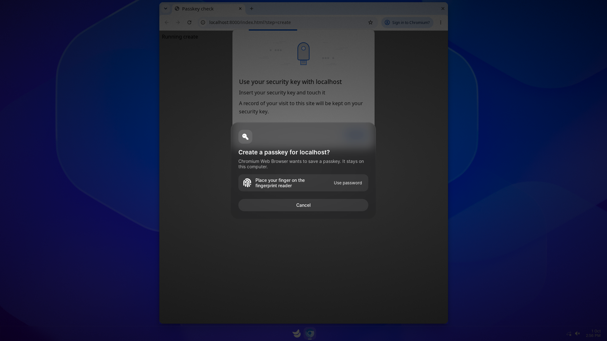

# Luft Passkeys

Luft Passkeys keeps passkeys on the computer, in [Luft Keyring](../keyring/README.md), and offers them to every browser and app. Creating a passkey or signing in with one shows a Kestrel prompt naming the site and the app, confirmed with your fingerprint or password.



Browsers see Luft Passkeys as a USB security key, so Chrome, Chromium-based browsers, Electron apps, Sabine apps and Firefox work without extensions.

| Part | Runs as | Does |
| --- | --- | --- |
| `luft-passkeys-relay` | root, one per connection, no capabilities | Creates the virtual security key (`/dev/uhid`) while its owner is at the screen |
| `luft-passkeys` | you | Speaks CTAP 2.1, asks Kestrel for confirmation, stores passkeys in Luft Keyring |
| Luft Keyring | you | Keeps passkeys in its Passkeys collection and makes every signature |
| Kestrel | you | Shows the prompt; `kestrel-authenticate` checks the fingerprint or password |

## Features

- Discoverable credentials, ES256 keys, built-in user verification, `credProtect` and `hmac-secret` (PRF)
- Private keys made inside the TPM when there is one, otherwise kept in the encrypted keyring
- Passkeys are bound to this computer and never marked as backed up
- Account picker in the same prompt when a site has several accounts
- Settings, under Security, lists passkeys by site with the last use, and can rename or remove them

| | Create | Sign in | Choose account | PRF | Manage from the browser |
| --- | --- | --- | --- | --- | --- |
| Chrome, Chromium, Helium, Electron, Sabine | Yes | Yes | Yes | Yes | No (Chrome asks for a PIN) |
| Firefox | Yes | Yes | Yes | Yes | Yes, in `about:webauthn` |

Browsers call it a security key and don't offer passkeys in autofill. That needs the [Credentials portal](https://github.com/flatpak/xdg-desktop-portal/pull/1889), which is still experimental.

## Install

Install Kestrel and Luft Keyring first (`kestrel/tools/install.sh install`), then:

```sh
kestrel/passkeys/install.sh install   # build, install into /opt/kestrel and enable
kestrel/passkeys/install.sh remove    # disable and remove
```

This installs both programs into `/opt/kestrel/libexec`, and the relay's socket and service, the session service and its D-Bus activation file under `/usr/local`. It enables `luft-passkeys-relay.socket` and the session service for every user. Removing leaves saved passkeys in the keyring.

The relay needs no SELinux policy of its own; its unit drops every capability and denies the network, home folders and every device except `/dev/uhid`.

## Development

```sh
cd kestrel/passkeys
cargo test
cargo clippy --all-targets -- -D warnings
```

`tools/check` runs Chromium and Firefox against Luft Passkeys in the Sushi VM, with a stand-in fingerprint reader:

```sh
export SUSHI_VM=~/.cache/luft-passkeys-vm
boot/sushi/scripts/vm/tree.sh && boot/sushi/scripts/vm/kestrel.sh
kestrel/passkeys/tools/check/prepare.sh && boot/sushi/scripts/vm/disk.sh
kestrel/passkeys/tools/check/run.py                     # with a TPM and a fingerprint
kestrel/passkeys/tools/check/run.py --no-tpm --password # without a TPM, with the password
```

`run.py` also takes `--browsers chromium,firefox` and `--shots <dir>` to save screenshots.

## Interfaces

| Bus name | Object | Interface | For |
| --- | --- | --- | --- |
| `com.lantharos.Passkeys` | `/com/lantharos/Passkeys1` | `com.lantharos.Passkeys1` | Settings: `List`, `Rename`, `Delete`, `Protection` and `Ready` properties, `Changed` signal |
| `com.lantharos.Kestrel.Passkeys` | `/com/lantharos/Kestrel/Passkeys` | `com.lantharos.Kestrel.Passkeys1` | The confirmation prompt, for `luft-passkeys` only |
| `com.lantharos.Keyring1` | `/com/lantharos/Keyring1` | `com.lantharos.Keyring1.Passkeys` | Storage and signing, for `luft-passkeys` only |

`Open(a{sv})` on the prompt interface returns a prompt object. `Next()` returns the person's next action (`account`, `password`, `confirm` or `cancel`) to the caller only, `Update(s, s)` shows a hint or error, and `Close()` ends it.
